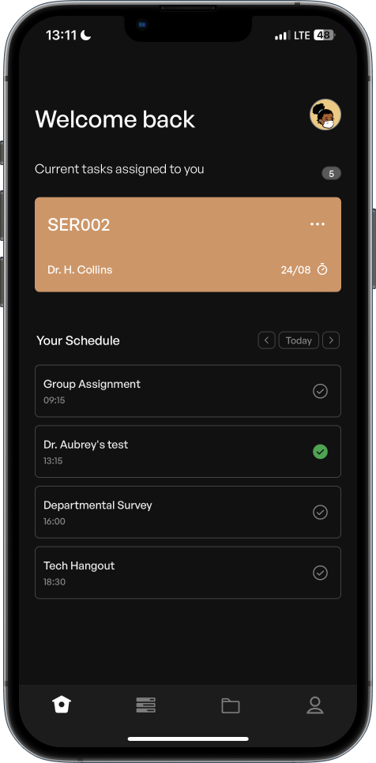

<div>
  
</div>

<div align="center">
    <h1>EduTrak</h1>
</div>

EduTrak is a mobile application built with React Native and Expo that aims to assist lecturers in setting quizzes and performing standardized assessments of their students. It provides a seamless experience for both students and lecturers, with dedicated pages for taking quizzes and setting quizzes.

### Features

- **Student Quiz Page**: Students can access a user-friendly interface to take quizzes assigned by their lecturers. They can view questions, select answers, and submit their responses.
- **Lecturer Quiz Page**: Lecturers have the ability to set quizzes by adding questions, assigning time limits, and specifying correct answers. They can also view and analyze the quiz results.
- **React Native and Expo**: The app is developed using the React Native framework and Expo, which ensures cross-platform compatibility and ease of development.
- **Firebase Integration**: EduTrak integrates with Firebase, a powerful cloud-based platform, to store quiz data and facilitate real-time synchronization between students and lecturers.

### Installation

Follow these steps to set up and run EduTrak on your local machine:

1. Clone the repository: `git clone https://github.com/codergon/edutrack.git`
2. Navigate to the project directory: `cd edutrack`
3. Install the dependencies: `npm install`
4. Create a Firebase project and set up a Firestore database.
5. Create a `.env` file in the project root and add your Firebase configuration and the Google client ID for your project from cloud console.
   Example:

   ```
   FIREBASE_API_KEY=your-api-key
   FIREBASE_AUTH_DOMAIN=your-auth-domain
   FIREBASE_PROJECT_ID=your-project-id
   FIREBASE_STORAGE_BUCKET=your-storage-bucket
   FIREBASE_MESSAGING_SENDER_ID=your-messaging-sender-id
   FIREBASE_APP_ID=your-app-id

   GOOGLE_CLIENT_ID=your-client-id
   ```

6. Start the Expo development server: `expo start`
7. Use an Android or iOS emulator, or scan the QR code with the Expo app on your physical device to run the app.

## Technologies Used

- React Native
- Expo
- Firebase (Firestore)

## Contributing

Contributions are welcome! If you find any issues or would like to add new features to EduTrak, please feel free to open an issue or submit a pull request. Make sure to follow the existing code style and guidelines.

## License

This project is licensed under the [MIT License](LICENSE).

## Acknowledgments

We would like to thank the following resources for their inspiration and contributions to EduTrak:

- React Native documentation: [https://reactnative.dev/docs](https://reactnative.dev/docs)
- Expo documentation: [https://docs.expo.io](https://docs.expo.io)
- Firebase documentation: [https://firebase.google.com/docs](https://firebase.google.com/docs)

Special thanks to the open-source community for their continuous support and contributions to the React Native and Expo ecosystems.
